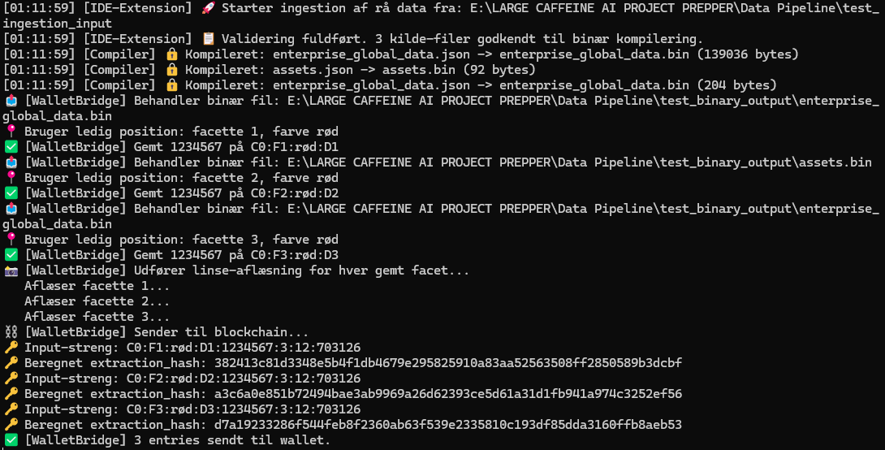
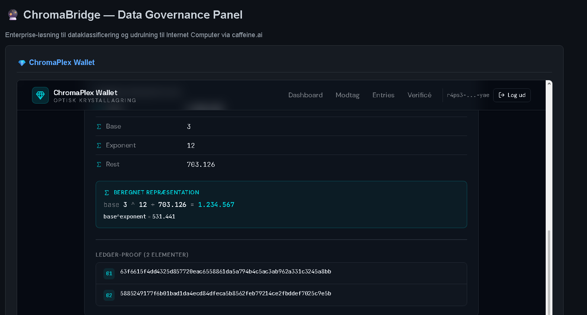

<p align="center">
  <h1 align="center">🔮 ChromaBridge</h1>
  <p align="center">
```
<strong>Enterprise Web3 Data Migration & Proof-of-Work Pipeline</strong><br>
<em>Bygget på Chromaplex OS v2 – 57 facetter, 5 farver, write-once ledger</em>
```
  </p>
  <p align="center">
```
<a href="#-installation-og-brug"></a>
<a href="LICENSE"></a>
<a href="https://github.com/Janus5G/chromaplex-os-v2"></a>
```
  </p>
</p>
## 

## Hvad er ChromaBridge?

ChromaBridge migrerer data fra traditionelle web-systemer (Web2) til **Internet Computer blockchain** (Web3). Det håndterer alt fra enkelte JSON-filer til hele webprojekter og sikrer, at data bliver **forankret on-chain** med kryptografiske beviser.

I stedet for at overføre rå bytes **komprimerer ChromaBridge** data via **eksponentiel repræsentation** (`base^exponent + rest`) og gemmer dem i en **57-facet krystal** med 5 farvekanaler og dybde. Hver skrivning registreres i en **write-once blockchain ledger** med SHA-256, hvilket giver proof-of-work og uforanderlig sikkerhed.
## 

## Hvorfor ChromaBridge?

| | ChromaBridge | Traditionel migrering |
|---|---|---|
| **Komprimering** | Eksponentiel repræsentation | Rå bytes / JSON |
| **Lagring** | 57-facet krystal (simuleret) | Database / filsystem |
| **Integritet** | Write-once ledger (SHA-256) | Kan overskrives |
| **Proof of Work** | Kryptografisk bevis pr. skrivning | Ingen |
| **On-chain verifikation** | Via ChromaPlex Wallet | Ingen |
| **Skalerbarhed** | Tusindvis af filer | Begrænset |
| **Web3-output** | Genererer Motoko-backend | Kun Web2 |
## 



## Arkitektur

```
┌─────────────────────────────────────────────────────────┐
│                    ChromaBridge Pipeline                 │
│                                                         │
│  ┌───────────┐   ┌───────────┐   ┌──────────────────┐  │
│  │  Scanner   │──▶│  Binary   │──▶│  Wallet Bridge   │  │
│  │ & Valider  │   │ Compiler  │   │  (on-chain)      │  │
│  └───────────┘   └───────────┘   └──────────────────┘  │
│       ▲                                    │            │
│       │           ┌───────────┐            ▼            │
│  JSON-filer       │  UI Layer │     ChromaPlex Wallet   │
│  (input)          │ :8090     │     (verifikation)      │
│                   └───────────┘                         │
└─────────────────────────────────────────────────────────┘
```

### Kernekomponenter

**UI-layer** (`chromaplex_app.py`) — HTTP-server med webbaseret interface, iframe til ChromaPlex Wallet, kopier-knap til JSON-payload og generering af Motoko-backend-kode.

**Scanner & validering** (`core/ide_extension.py`) — Scanner mappestrukturen for JSON-filer, validerer format og indhold, godkender filer til videre behandling.

**Binary Compiler** (`core/binary_compiler.py`) — Kompilerer JSON til Chromaplex `.bin`-format (CPX2) med header: `[CPX2][timestamp][data_længde][JSON]`.

**Wallet Bridge** (`core/wallet_bridge.py`) — Finder ledig krystalposition (write-once, roterer gennem 57 facetter × 5 farver), gemmer data via `store()`, aflæser via `lens_capture()` og genererer JSON-payload med `extraction_hash` og `ledger_proof`.
## 

## Kom i gang

```bash
git clone https://github.com/Janus5G/ChromaBridge.git
cd ChromaBridge
```

```bash
python -m venv venv
source venv/bin/activate      # Linux/macOS
# venv\Scripts\activate       # Windows
```

```bash
pip install git+https://github.com/Janus5G/chromaplex-os-v2.git
pip install -r requirements.txt
```

<details>
<summary>📂 Forbered dine data</summary>

<br>

Placér JSON-filer i `test_ingestion_input/database/`. Hver fil skal mindst indeholde:

```json
{
  "value": 1234567,
  "representation": "3^12 + 703126",
  "source_address": "C0:F5:virksomhed:D0"
}
```

Se [`example.json`](example.json) for et køreklart eksempel.

</details>

### Start serveren

```bash
python -u chromaplex_app.py
```

Åbn **http://localhost:8090** – derefter:

> **Generér JSON Payload** → **📋 Kopier JSON** → åbn **Modtag** i ChromaPlex Wallet → **Verificér & Gem**

✅ Data er nu on-chain med din Internet Identity.
## 



## Hvad bygger ChromaBridge på?

ChromaBridge udnytter alle kernemekanismer i [Chromaplex OS v2](https://github.com/Janus5G/chromaplex-os-v2):

- 57 facetter + 5 farvekanaler + dybde
- Eksponentiel datakomprimering (`base^exponent + rest`)
- Blockchain ledger med SHA-256 og write-once
- Lens receiver (passiv aflæsning uden slid)
- On-chain verifikation via ChromaPlex Wallet
## 

## Bidrag

Pull requests og issues er velkomne! Projektet er under [MIT-licens](LICENSE).
## 

<p align="center">
  Udviklet med ❤️ og ☕ af <strong>Janus</strong><br>
  <em>ChromaBridge – Fra Web2 til Web3, gennem krystallen. 🔮</em>
</p>